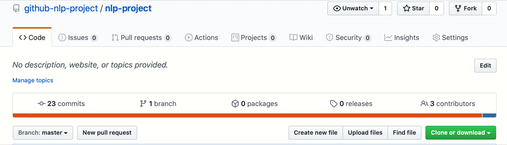

# GitHub NLP Project

For this project, we scraped data from GitHub repository README files using GitHub's API. 

## Goal

The primary goal for this project was to build an NLP model that can predict the primary language of REPO using the text in the README file.

As a secondary goal, we decided to pull repos from a specific sector, or topic, to see if an industry we were interested is utilizing a program language we're familiar with.

Due to the first and second goals, this repo can be used as a means to research an potenial industry you might be interested in entering, and knowing what programming language you'll need to have familiarity with.

## Deliverables

> A well-documented jupyter notebook that contains your analysis.

LINK TO SPECIFIC notebook

> Three to four slide deck suitable for a general audience that summarize your findings - including well-labelled visualizations

LINK TO DECK

## Exploration

Some of the questions answered in either the notebook or deck:

1. What are the most common words in READMEs?

2. What does the distribution of IDFs look like for the most common words?

3. Does the length of the README vary by programming language?

4. Do different programming languages use a different number of unique words?

## Model

INFO ABOUT MODEL RESULTS

## SUMMARY

INFO ABOUT OUR FINDINGS

## Want to use our code?

You can use our python files to recreate the work done in our notebook. You'll also need to get create an env.py file that includes your GitHub username and GitHub token.

***Be sure to include a .gitignore file that includes that env.py***